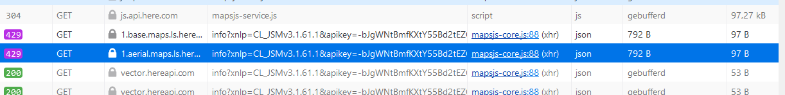

# WeatherSite
Link to the site: https://h126564.github.io/RunRadar/
Pagina1: Algemeen weer op specifieke locatie met hardlooptermen
Pagina2: Gebruiker kan een speciefike hardlooproute specificeren dmv van google maps imbed. Laat dan weer op verschillende plekken op de route zien dmv van een forecast. 
Pagina3: Wanneer is het beste hardloopweer? Dmv van een 2.5-daagse forecast beste hardloopweer laten zien in de door jouw ingestelde regio.

Github icons openweatherapi: https://github.com/rodrigokamada/openweathermap

api site https://open-meteo.com/en/docs
api call temperatuur: https://api.open-meteo.com/v1/forecast?latitude=51.834693582810125&longitude=4.12083064600806&hourly=temperature_2m

api geocoding: https://geocode.maps.co/search?q=helinium&api_key=67346201ecee5360511634fte9d92c5 

APi call openweatherforecast: https://api.openweathermap.org/data/2.5/forecast?lat=51.826&lon=4.118&appid=c147b5c83a42fbf37236c537fb83e881
API call openweatherlive: https://api.openweathermap.org/data/2.5/weather?lat=51.826&lon=4.118&appid=c147b5c83a42fbf37236c537fb83e881

wij gebruiken de apis, stoppen deze in een global object waardoor wij niet in verschillende js bestand voor dezelfde paginas de api meerdere keren hoeven te callen
Wij gebruiken waar mogelijk (bv op pagina 1 per uur gedeelte en 2 daagse verwachting) lazy rendering ipv per frame rendering

Map rendering: https://platform.here.com/portal/
map api for route: https://www.here.com/docs/bundle/maps-api-for-javascript-developer-guide/page/topics/routing.html 
